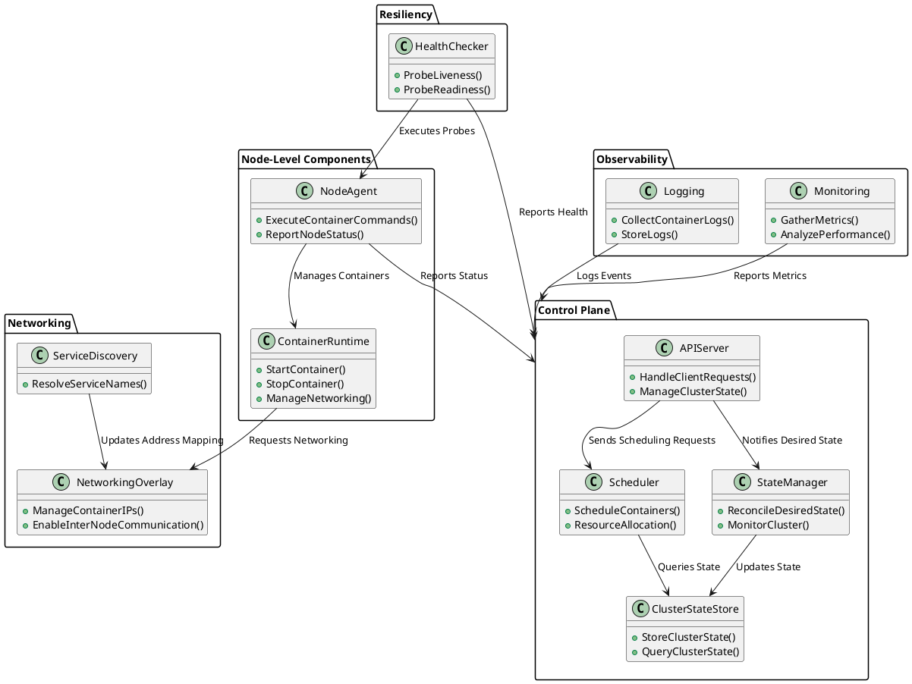

```plantuml
@startuml
package "Control Plane" {
    class APIServer {
        + HandleClientRequests()
        + ManageClusterState()
    }
    class Scheduler {
        + ScheduleContainers()
        + ResourceAllocation()
    }
    class StateManager {
        + ReconcileDesiredState()
        + MonitorCluster()
    }
    class ClusterStateStore {
        + StoreClusterState()
        + QueryClusterState()
    }
    
    APIServer --> Scheduler : Sends Scheduling Requests
    APIServer --> StateManager : Notifies Desired State
    StateManager --> ClusterStateStore : Updates State
    Scheduler --> ClusterStateStore : Queries State
}

package "Node-Level Components" {
    class NodeAgent {
        + ExecuteContainerCommands()
        + ReportNodeStatus()
    }
    class ContainerRuntime {
        + StartContainer()
        + StopContainer()
        + ManageNetworking()
    }
    
    NodeAgent --> ContainerRuntime : Manages Containers
    NodeAgent --> "Control Plane" : Reports Status
}

package "Networking" {
    class ServiceDiscovery {
        + ResolveServiceNames()
    }
    class NetworkingOverlay {
        + ManageContainerIPs()
        + EnableInterNodeCommunication()
    }
    
    ContainerRuntime --> NetworkingOverlay : Requests Networking
    ServiceDiscovery --> NetworkingOverlay : Updates Address Mapping
}

package "Resiliency" {
    class HealthChecker {
        + ProbeLiveness()
        + ProbeReadiness()
    }
    HealthChecker --> NodeAgent : Executes Probes
    HealthChecker --> "Control Plane" : Reports Health
}

package "Observability" {
    class Logging {
        + CollectContainerLogs()
        + StoreLogs()
    }
    class Monitoring {
        + GatherMetrics()
        + AnalyzePerformance()
    }
    Logging --> "Control Plane" : Logs Events
    Monitoring --> "Control Plane" : Reports Metrics
}

@enduml

```

